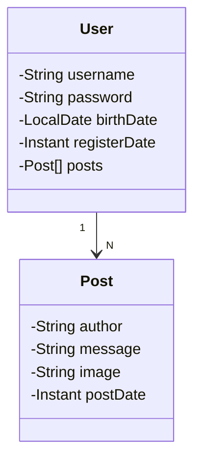

# Blog System

Java RESTful API para o desafio da DIO

## Diagrama de Classes

```mermaid
classDiagram
  class User {
    -String username
    -String password
    -LocalDate birthDate
    -Instant registerDate
    -Post[] posts
  }

  class Post {
    -String author
    -String message
    -String image
    -Instant postDate
  }

  User "1" --> "N" Post

```
